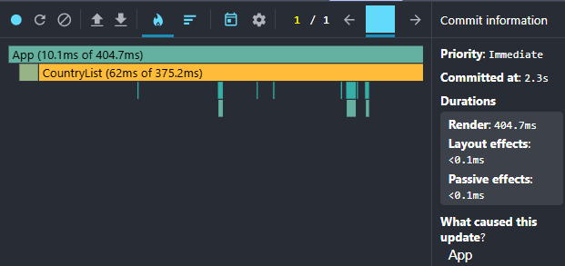
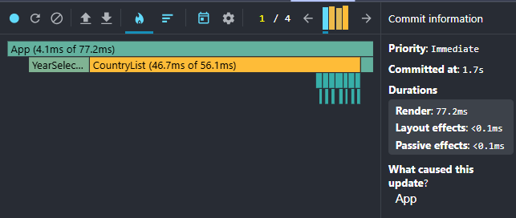

# Performance Optimization Report

## Baseline Measurements

### Interaction A: Sort countries

- **Commit duration**: [N/A](https://discord.com/channels/794806036506607647/1333748258098380820/1515111545905090610) (In short, let's just focus on the "Render duration" metric in the report for now. By the next iteration, I'll adjust it to something like: "Number of commits + duration per commit.")
- **Render duration**: 404 ms
- **Screenshot**:

  

---

### Interaction B: Search countries

- **Commit duration**: [N/A](https://discord.com/channels/794806036506607647/1333748258098380820/1515111545905090610) (In short, let's just focus on the "Render duration" metric in the report for now. By the next iteration, I'll adjust it to something like: "Number of commits + duration per commit.")
- **Render duration**: 197.5 ms
- **Screenshot**:

  

---

### Interaction C: Change year

- **Commit duration**: [N/A](https://discord.com/channels/794806036506607647/1333748258098380820/1515111545905090610) (In short, let's just focus on the "Render duration" metric in the report for now. By the next iteration, I'll adjust it to something like: "Number of commits + duration per commit.")
- **Render duration**: 468.8 ms
- **Screenshot**:

  

---

### Interaction D: Toggle column

- **Commit duration**: [N/A](https://discord.com/channels/794806036506607647/1333748258098380820/1515111545905090610) (In short, let's just focus on the "Render duration" metric in the report for now. By the next iteration, I'll adjust it to something like: "Number of commits + duration per commit.")
- **Render duration**: 377.3 ms
- **Screenshot**:

  

---

## Optimized Measurements

### Interaction A: Sort countries

- **Commit duration**: [N/A](https://discord.com/channels/794806036506607647/1333748258098380820/1515111545905090610) (In short, let's just focus on the "Render duration" metric in the report for now. By the next iteration, I'll adjust it to something like: "Number of commits + duration per commit.")
- **Render duration**: 97.2 ms
- **Screenshot**:

  

---

### Interaction B: Search countries

- **Commit duration**: [N/A](https://discord.com/channels/794806036506607647/1333748258098380820/1515111545905090610) (In short, let's just focus on the "Render duration" metric in the report for now. By the next iteration, I'll adjust it to something like: "Number of commits + duration per commit.")
- **Render duration**: 68.4 ms
- **Screenshot**:

  

---

### Interaction C: Change year

- **Commit duration**: [N/A](https://discord.com/channels/794806036506607647/1333748258098380820/1515111545905090610) (In short, let's just focus on the "Render duration" metric in the report for now. By the next iteration, I'll adjust it to something like: "Number of commits + duration per commit.")
- **Render duration**: 96 ms
- **Screenshot**:

  

---

### Interaction D: Toggle column

- **Commit duration**: [N/A](https://discord.com/channels/794806036506607647/1333748258098380820/1515111545905090610) (In short, let's just focus on the "Render duration" metric in the report for now. By the next iteration, I'll adjust it to something like: "Number of commits + duration per commit.")
- **Render duration**: 77.2 ms
- **Screenshot**:

  

---

## Comparison

| Interaction    | Before (ms) | After (ms) | Improvement |
|----------------|-------------|------------|-------------|
| Sort countries | 404         | 97.2       | −76%        |
| Search         | 197.5       | 68.4       | −65%        |
| Change year    | 468.8       | 96         | −80%        |
| Toggle column  | 377.3       | 77.2       | −80%        |
