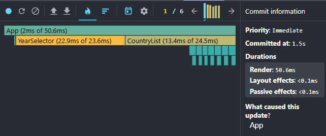

# Performance Optimization Report

## Baseline Measurements

### Interaction A: Sort countries

- **Commit duration**: [N/A](https://discord.com/channels/794806036506607647/1333748258098380820/1515111545905090610) (In short, let's just focus on the "Render duration" metric in the report for now. By the next iteration, I'll adjust it to something like: "Number of commits + duration per commit.")
- **Render duration**: 404 ms
- **Screenshot**:

  

---

### Interaction B: Search countries

- **Commit duration**: [N/A](https://discord.com/channels/794806036506607647/1333748258098380820/1515111545905090610) (In short, let's just focus on the "Render duration" metric in the report for now. By the next iteration, I'll adjust it to something like: "Number of commits + duration per commit.")
- **Render duration**: 197.5 ms
- **Screenshot**:

  

---

### Interaction C: Change year

- **Commit duration**: [N/A](https://discord.com/channels/794806036506607647/1333748258098380820/1515111545905090610) (In short, let's just focus on the "Render duration" metric in the report for now. By the next iteration, I'll adjust it to something like: "Number of commits + duration per commit.")
- **Render duration**: 468.8 ms
- **Screenshot**:

  

---

### Interaction D: Toggle column

- **Commit duration**: [N/A](https://discord.com/channels/794806036506607647/1333748258098380820/1515111545905090610) (In short, let's just focus on the "Render duration" metric in the report for now. By the next iteration, I'll adjust it to something like: "Number of commits + duration per commit.")
- **Render duration**: 377.3 ms
- **Screenshot**:

  

---

## Optimized Measurements

### Interaction A: Sort countries

- **Commit duration**: [N/A](https://discord.com/channels/794806036506607647/1333748258098380820/1515111545905090610) (In short, let's just focus on the "Render duration" metric in the report for now. By the next iteration, I'll adjust it to something like: "Number of commits + duration per commit.")
- **Render duration**: 94.1 ms
- **Screenshot**:
  - ***Virtualization and proper keys***
  
  

  - ***Computed values (useMemo)***

  

---

### Interaction B: Search countries

- **Commit duration**: [N/A](https://discord.com/channels/794806036506607647/1333748258098380820/1515111545905090610) (In short, let's just focus on the "Render duration" metric in the report for now. By the next iteration, I'll adjust it to something like: "Number of commits + duration per commit.")
- **Render duration**: 50.6 ms
- **Screenshot**:
  - ***Virtualization and proper keys***

  

  - ***Computed values (useMemo)***
  
  
---

### Interaction C: Change year

- **Commit duration**: [N/A](https://discord.com/channels/794806036506607647/1333748258098380820/1515111545905090610) (In short, let's just focus on the "Render duration" metric in the report for now. By the next iteration, I'll adjust it to something like: "Number of commits + duration per commit.")
- **Render duration**: 80.5 ms
- **Screenshot**:
  - ***Virtualization and proper keys***

  

  - ***Computed values (useMemo)***

  
---

### Interaction D: Toggle column

- **Commit duration**: [N/A](https://discord.com/channels/794806036506607647/1333748258098380820/1515111545905090610) (In short, let's just focus on the "Render duration" metric in the report for now. By the next iteration, I'll adjust it to something like: "Number of commits + duration per commit.")
- **Render duration**: 33.4 ms
- **Screenshot**:
  - ***Virtualization and proper keys***

  

  - ***Computed values (useMemo)***

  
---

## Comparison

| Interaction    | Before (ms) | After (ms) | Improvement |
|----------------|-------------|------------|-------------|
| Sort countries | 404         | 94.1       | −77%        |
| Search         | 197.5       | 50.6       | −74%        |
| Change year    | 468.8       | 80.5       | −83%        |
| Toggle column  | 377.3       | 33.4       | −91%        |
