# Performance Optimization Report

## Baseline Measurements

### Interaction A: Sort countries

- **Commit duration**: [N/A](https://discord.com/channels/794806036506607647/1333748258098380820/1515111545905090610) (In short, let's just focus on the "Render duration" metric in the report for now. By the next iteration, I'll adjust it to something like: "Number of commits + duration per commit.")
- **Render duration**: 404 ms
- **Screenshot**:

  

---

### Interaction B: Search countries

- **Commit duration**: [N/A](https://discord.com/channels/794806036506607647/1333748258098380820/1515111545905090610) (In short, let's just focus on the "Render duration" metric in the report for now. By the next iteration, I'll adjust it to something like: "Number of commits + duration per commit.")
- **Render duration**: 197.5 ms
- **Screenshot**:

  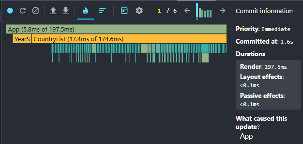

---

### Interaction C: Change year

- **Commit duration**: [N/A](https://discord.com/channels/794806036506607647/1333748258098380820/1515111545905090610) (In short, let's just focus on the "Render duration" metric in the report for now. By the next iteration, I'll adjust it to something like: "Number of commits + duration per commit.")
- **Render duration**: 468.8 ms
- **Screenshot**:

  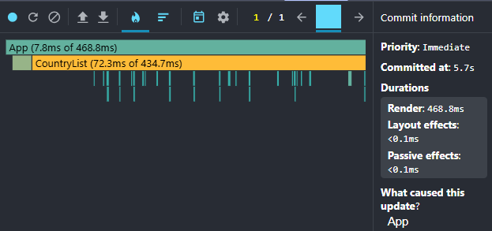

---

### Interaction D: Toggle column

- **Commit duration**: [N/A](https://discord.com/channels/794806036506607647/1333748258098380820/1515111545905090610) (In short, let's just focus on the "Render duration" metric in the report for now. By the next iteration, I'll adjust it to something like: "Number of commits + duration per commit.")
- **Render duration**: 377.3 ms
- **Screenshot**:

  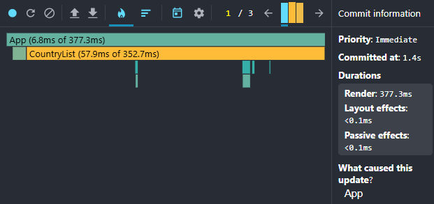

---

## Optimized Measurements

### Interaction A: Sort countries

- **Commit duration**: [N/A](https://discord.com/channels/794806036506607647/1333748258098380820/1515111545905090610) (In short, let's just focus on the "Render duration" metric in the report for now. By the next iteration, I'll adjust it to something like: "Number of commits + duration per commit.")
- **Render duration**: 75.7 ms
- **Screenshot**:
  - **_Virtualization and proper keys_**

  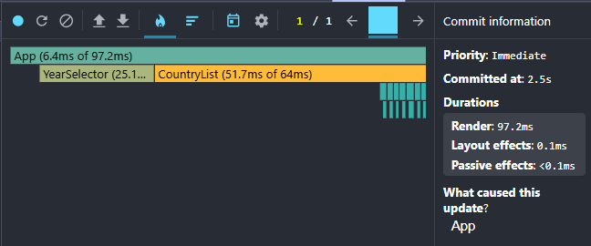
  - **_Computed values (useMemo)_**

  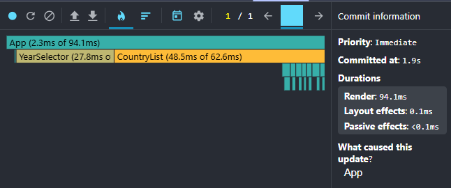
  - **_Event handlers (useCallback) + React.memo_**

  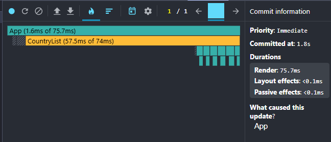

---

### Interaction B: Search countries

- **Commit duration**: [N/A](https://discord.com/channels/794806036506607647/1333748258098380820/1515111545905090610) (In short, let's just focus on the "Render duration" metric in the report for now. By the next iteration, I'll adjust it to something like: "Number of commits + duration per commit.")
- **Render duration**: 37.9 ms
- **Screenshot**:
  - **_Virtualization and proper keys_**

  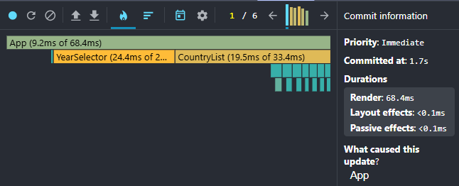
  - **_Computed values (useMemo)_**

  
  - **_Event handlers (useCallback) + React.memo_**

  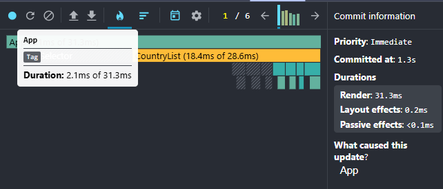
  - **_Controls component isolation (React.memo)_**

  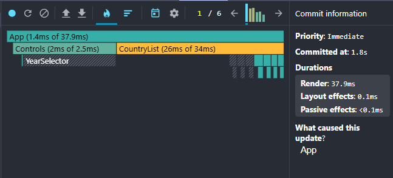

---

### Interaction C: Change year

- **Commit duration**: [N/A](https://discord.com/channels/794806036506607647/1333748258098380820/1515111545905090610) (In short, let's just focus on the "Render duration" metric in the report for now. By the next iteration, I'll adjust it to something like: "Number of commits + duration per commit.")
- **Render duration**: 80.5 ms
- **Screenshot**:
  - **_Virtualization and proper keys_**

  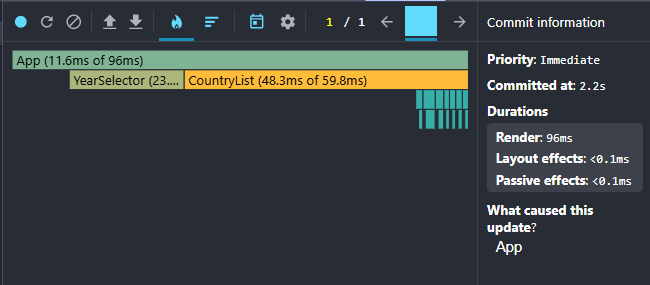
  - **_Computed values (useMemo)_**

  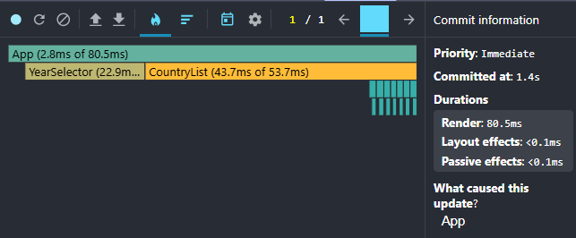

---

### Interaction D: Toggle column

- **Commit duration**: [N/A](https://discord.com/channels/794806036506607647/1333748258098380820/1515111545905090610) (In short, let's just focus on the "Render duration" metric in the report for now. By the next iteration, I'll adjust it to something like: "Number of commits + duration per commit.")
- **Render duration**: 16.5 ms
- **Screenshot**:
  - **_Virtualization and proper keys_**

  
  - **_Computed values (useMemo)_**

  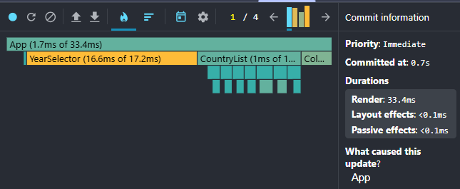
  - **_Event handlers (useCallback) + React.memo_**

  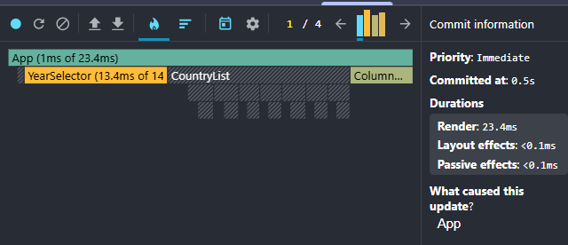
  - **_Controls component isolation (React.memo)_**

  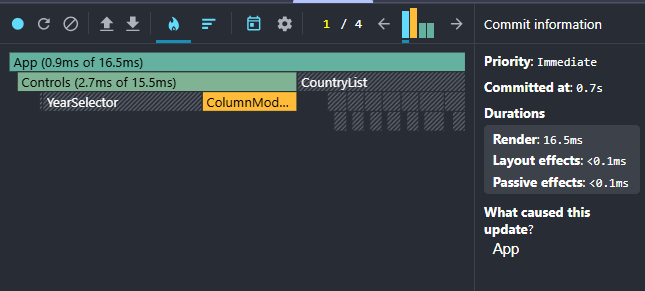

---

## Comparison

| Interaction    | Before (ms) | After (ms) | Improvement |
| -------------- | ----------- | ---------- | ----------- |
| Sort countries | 404         | 75.7       | 81%         |
| Search         | 197.5       | 37.9       | 81%         |
| Change year    | 468.8       | 80.5       | 83%         |
| Toggle column  | 377.3       | 16.5       | 96%         |
